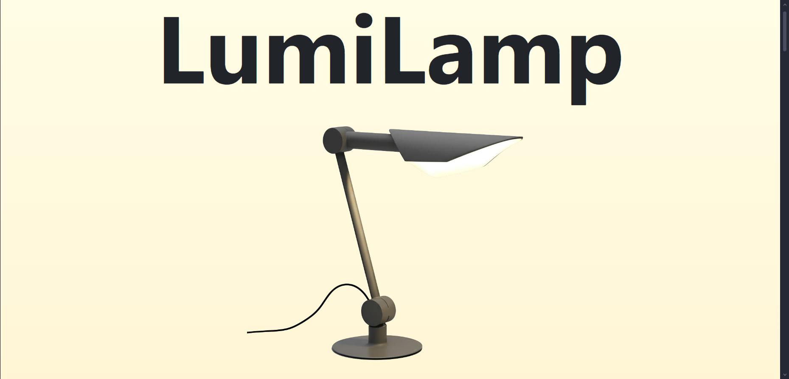
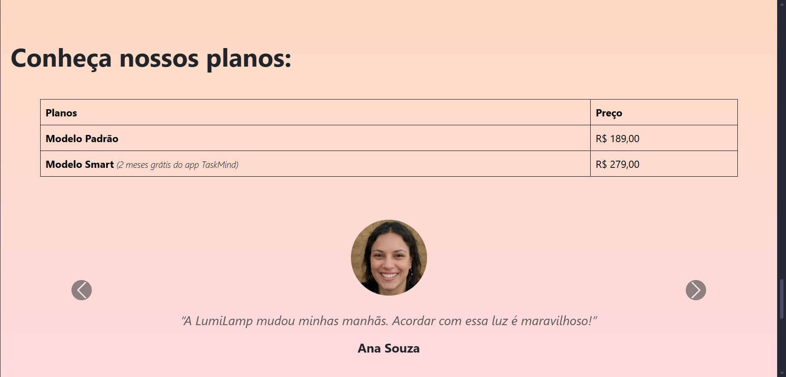
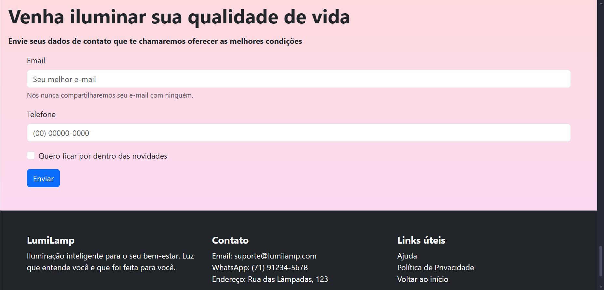

# 💡 Desafio LumiLamp

Este repositório contém a solução para o **Desafio LumiLamp**, desenvolvido com foco em simplicidade, acessibilidade e design responsivo.

## 📁 Estrutura do Projeto

A estrutura principal do projeto inclui:

- `index.html` – Página principal
- `help.html` – Página de ajuda
- `privacy-policy.html` – Política de privacidade
- `style.css` – Estilos gerais do site
- `images/` – Pasta com os recursos visuais utilizados

## 🚀 Tecnologias Utilizadas

- **HTML5** – Estruturação das páginas
- **CSS3** – Estilização e responsividade
- - **Bootstrap** – Framework front-end para design responsivo

## ✅ Funcionalidades

- Interface amigável com foco em acessibilidade
- Layout responsivo para diferentes tamanhos de tela
- Páginas de ajuda e política de privacidade integradas

## 📷 Capturas de tela da aplicação:
  

  
  
  

  
  

## 🛠️ Como executar

1. Clone o repositório:
   ```bash
   git clone https://github.com/Gabrieldamasc/Desafio-LumiLamp.git
